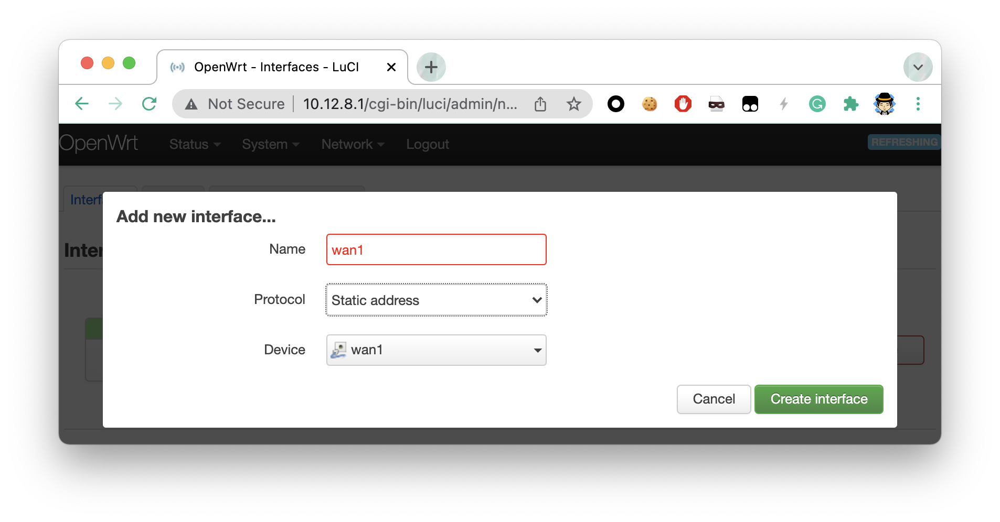

# Dr.COM HTTP Multidial

适用于Dr.COM的HTTP登录方式下的监控脚本，且提供了多拨环境下网卡绑定的支持。目前仅支持配合OpenWRT+mwan3使用。

本项目的登录方式源于[github.com:Hagb/cqu-duodian-curl](https://github.com/Hagb/cqu-duodian-curl)，感谢该脚本作者提供此idea。

## 所依赖的软件包：

- iproute2
- curl

## 所需要的Python库：

- time
- os

以上库均在OpenWRT的软件包的`python3-base`中提供。

## 已经过测试的学校：

- 重庆大学A区
- 重庆大学虎溪校区

## Q&A

1. 为什么删除IPv6支持：

    目前大多数使用Dr.COM认证的学校（如重庆大学），IPv6认证采用访问IPv6 HTTP网页后302到IPv4认证服务器的方式，且在302的地址上包括了本机的IPv6地址，因此我们只需要在crontab中定期执行 `curl -6 -L http://某个IPv6网站` 即可完成IPv6的Keep alive，且目前IPv6没有限速，无需多拨。

2. 如果使用的非OpenWRT，如何使用？

    推荐使用OpenWRT+mwan3进行，若自己使用其他方式进行负载均衡需要在main.py中修改 `check_status()` 函数，使其不从mwan3得到端口的状态。

## 使用方法：

基于OpenWRT 21.04官方版本。

1. 安装luci-app-mwan3、kmod-macvlan、python3-base、curl
```shell
opkg install luci-app-mwan3 kmod-macvlan python3-base curl
```
2. 设置单线多拨

在上方菜单进入Network->Interface，然后在Device选项卡中，点击`Add device configuration`，然后给wan口添加多个虚拟接口，如图所示：


3. 回到Network->Interface的Interface选项卡，添加新的WAN接口，并进行IP、DNS的设置。




**这里需要注意的是，每个wan（包括原先自动创建的wan），都必须在Advanced Settings中设置Use Gateway Metric，填写任意数字即可。**


4. 在mwan3中添加接口

在上方菜单进入Network->Load Balancing（若没有找到请在安装luci-app-mwan3后重启路由器），删除原有的配置，然后添加2个我们的物理网卡。


注意，添加后，需要勾选Enable选项，然后添加几个外网才能访问的IP地址作为Tracking IP，并一定要在最后勾上Flush conntrack table的4个选项。


```bash
sudo su
vi main.py# 根据自己的情况修改config部分
python3 main.py
```

5. 设置每个端口的Metric和权重

Metric表示的是端口使用的优先级，例如，Metric 0的端口存在一个可用，那么就不会去使用Metric大于0的任何端口。如果我们有一个速率较低的上网账号只想在12点断网后使用，可以写Metric 0，并将自己的其它带宽更大的上网账号设置为Metric 1。

而同级Metric中，不同的Weight表示的是分配到这个端口的概率。例如我们分别有20M和40M的上网账号，可以像我这样配置：


6. 设置mwan3 policies

这里推荐只使用一个balanced，将所有端口加进来即可，然后Last resort推荐使用default。


7. 设置mwan3 rules

这里是考虑到部分应用可能存在检测到不同IP地址会出现异常的情况，因此对于https 443端口设置一个sticky，其它都balanced即可。


8. 在脚本中修改各个用户的配置以及认证服务器，然后传到路由器上（推荐存储为`/usr/drcom.py`目录），并试运行：


```shell
# 传送drcom.py到/usr，新手在Windows下可以通过WinSCP工具。
cd /usr
python3 drcom.py
```


成功后按Ctrl+C退出。

9. 将本仓库的`examples/init.d-script.sh`脚本，放置到`/etc/init.d/drcom`，并加上执行权限。

**注意：如果你Python脚本存储的位置并非`/usr/drcom.py`，需要进行相应的调整。**


```shell
# 先将文件传上去，并重命名为drcom（不带后缀）
cd /etc/init.d
chmod a+x drcom
/etc/init.d/drcom enable # 让它开机自启
/etc/init.d/drcom start  # 启动
ps | grep drcom          # 查看进程当前运行状态
```


10. 进入路由器上方菜单的Status->Load Balancing，查看两个端口状态：


均为绿色说明成功。